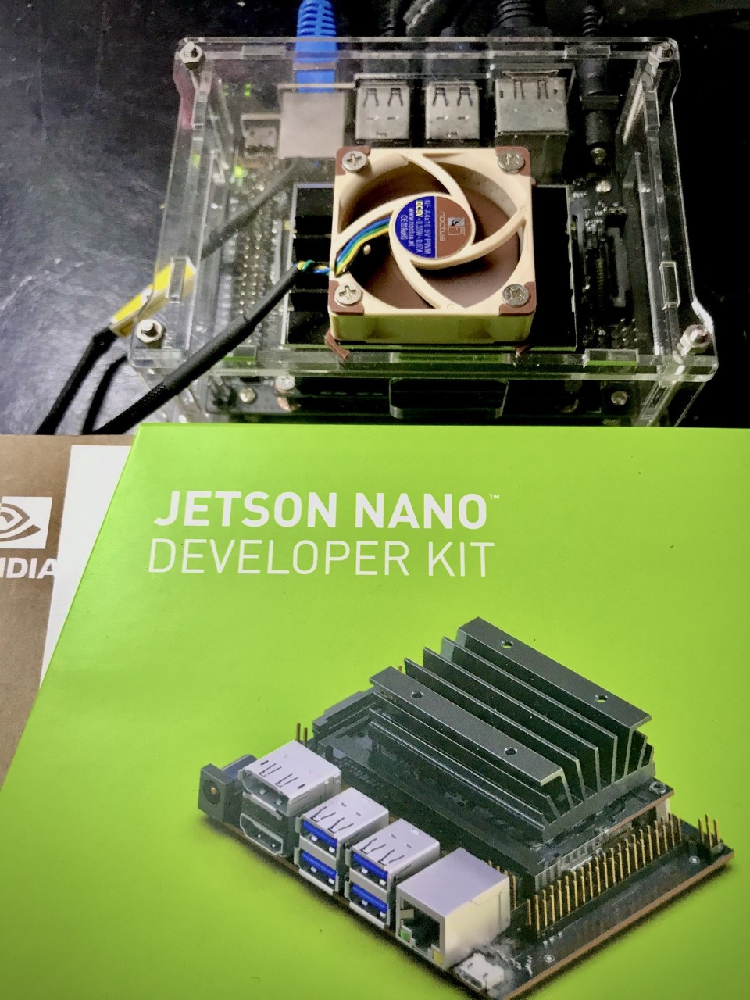

PREPARATION REQUIRED BEFORE ANYTHING ELSE

# 1. INSTALL BAZEL 0.26.1

Why I chose bazel 0.26.1 – Reference : https://www.tensorflow.org/install/source
download - https://github.com/bazelbuild/bazel/releases/download/0.26.1/bazel-0.26.1-dist.zip
unzip into ~/bazel
```
env EXTRA_BAZEL_ARGS="--host_javabase=@local_jdk//:jdk" bash 
./compile.sh
```
# 2. INCREASE SWAP SIZE to 16 GB
```
sudo swapoff -a
sudo dd if=/dev/zero of=/swapfile bs=1G count=16
sudo mkswap /swapfile
sudo swapon /swapfile
grep SwapTotal /proc/meminfo
```
# 3. SWAP MEMORY UTILISATION PARAMETERS
```
sudo sysctl -w vm.swappiness=15
sudo sysctl -w vm.vfs_cache_pressure=50
sudo sysctl -w vm.dirty_background_ratio=15
sudo sysctl -w vm.dirty_ratio=20
```
# 4. Download and unzip tensorflow codes

go download https://github.com/tensorflow/tensorflow/archive/v2.0.0.zip
unzip v2.0.0.zip
mv tensorflow* ~/home/tensorflow

# 5. Clean up temp files
```
bazel clean --expunge_async
sudo rm -rf /home/keng/.cache/
```
**START THE BUILD**
 
# 6. Configure tensorflow
```
./configure
```

Use the following parameters
```
/usr/bin/python3
/usr/lib/python3/dist-packages
No XLA JIT support
No OpenCL SYNC
no ROCm support
No MPI support
Select CUDA
Compute - 5.3
TensorRT Yes
```

# 7. Start Building [cannot do a --config=opt ]
```
bazel build --jobs 4 --ram_utilization_factor 50 --verbose_failures --config=cuda --config=nonccl //tensorflow/tools/pip_package:build_pip_package &
```
After **12 hours + ** , you will get to see the following
```
Target //tensorflow/tools/pip_package:build_pip_package up-to-date:
bazel-bin/tensorflow/tools/pip_package/build_pip_package
INFO: Elapsed time: 173671.457s, Critical Path: 11264.65s
INFO: 24692 processes: 24692 local.
INFO: Build completed successfully, 34035 total actions
```
```
./bazel-bin/tensorflow/tools/pip_package/build_pip_package /tmp/tensorflow_pkg
```
```
Tue Oct 8 14:57:26 +08 2019 : === Building wheel
warning: no files found matching '*.pyd' under directory '*'
warning: no files found matching '*.pd' under directory '*'
warning: no files found matching '*.dylib' under directory '*'
warning: no files found matching '*.dll' under directory '*'
warning: no files found matching '*.lib' under directory '*'
warning: no files found matching '*.csv' under directory '*'
warning: no files found matching '*.h' under directory 'tensorflow_core/include/tensorflow'
warning: no files found matching '*' under directory 'tensorflow_core/include/third_party'
Tue Oct 8 14:59:44 +08 2019 : === Output wheel file is in: /tmp/tensorflow_pkg
```
Since it is so difficult to generate a whl file, I make sure I copy the wheel file over to a safe location instead of leaving it at /tmp

**EXTREMELY IMPORTANT**

add to bash.rc PYTHONPATH with /home/keng/.local/lib/python3.6/site-packages/
```
pip3 install tensorflow*.whl --user --ignore-installed
```
When --user is specified, the wheel will be installed on .local/lib instead of /usr/lib
Also, the ignore-installed will force the installation of pre-requisite packages

# 8. Test out the tensorflow if it can load
```
python3
import tensorflow as tf
tf.__version__
```
